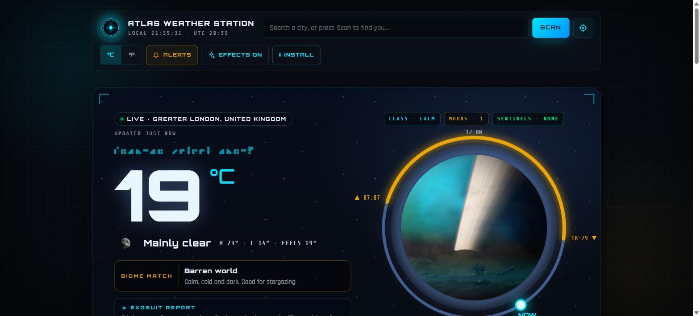
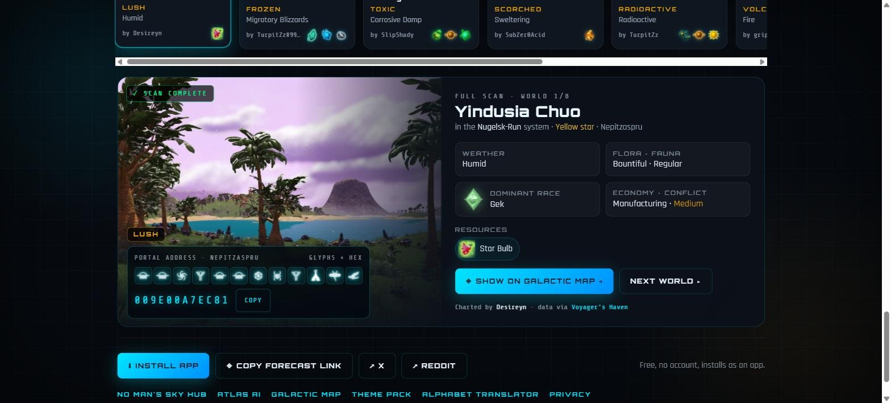

# NMS Weather — real weather as a No Man's Sky planet scan

**Live:** [weather.nomansskyhub.app](https://weather.nomansskyhub.app)

A free weather app themed on *No Man's Sky*. Your real local forecast shows up as an in-game style planet scan: the weather picks a biome, and the sky, effects and exosuit hazard readings follow it. No account, no ads, and it installs as an app on phones and desktops.

Part of the [No Man's Sky Hub](https://nomansskyhub.app) family of fan tools.

## What it does

- **Live weather as a biome.** Storms read as Extreme, snow or freezing as Frozen, rain or fog as Marsh, heat as Scorched, poor air as Toxic, high UV as Radioactive, clear nights as Barren, and everything else as Lush. The hero sky, rain/snow/lightning effects and planet image all change to match.
- **Exosuit hazard protection.** "Your exosuit readings are…" Heat, cold, UV and air quality shown as shield bars using the game's own hazard icons.
- **Forecast.** Next 24 hours (temperature, rain and wind charts with sunrise/sunset), a 7-day range view, and 9 tiles grouped by what they tell you: how it feels (feels like, wind compass, humidity and dew point), the sky (rain, pressure trend, visibility), then sun and air (UV, air quality, sun path).
- **Rain radar.** An animated map of the last two hours of rain and snow around you, with play/pause and a time slider (radar by [RainViewer](https://www.rainviewer.com), map by Esri/OpenStreetMap).
- **Storm warnings.** An in-game style "Extreme weather approaching" banner with a countdown.
- **Daily planetary survey.** 8 real planets charted by players on [Voyager's Haven](https://havenmap.online), one for each biome, changing each day. Every scan shows the portal address as glyphs, the discoverer, resources, and a link to open the system on the [NMS Galactic Map](https://map.nomansskyhub.app).
- **Alerts, even when the app is closed:** rain soon, extreme weather, big temperature changes, a morning briefing, an evening outlook for tomorrow (after 18:00) and the new daily survey. A scheduled Netlify function checks the forecast every 30 minutes. It needs `VAPID_PUBLIC_KEY`, `VAPID_PRIVATE_KEY` (secret) and `VAPID_SUBJECT` set on Netlify, with the same public key in `app-v2.js`. If the server can't send, the app says so and keeps alerting while it's open. A rain alert needs at least a 55% chance, or a rain/snow forecast with at least 35%, so it never fires on a 0% hour. Alerts show the app's diamond-in-ring mark in the phone's status bar (`badge-96.png`, white on transparent as Android requires). See the [privacy page](https://weather.nomansskyhub.app/privacy.html) for what is stored and how to remove it.
- **Expedition alerts:** opt in to a notification the day a new No Man's Sky expedition starts and a last call 24 hours before the current one ends (dates from the NMS Wiki's expedition list, checked by the same 30-minute function). Tapping one opens ATLAS. ATLAS and the Hub link here with `?alerts=exp`, which opens the alert settings.
- **Share my planet:** one tap draws today's scan as a 1080×1350 card (planet, place, temperature, biome match, exosuit report, and your Traveller ID name if you set one on the Hub) and opens the phone's share sheet; browsers that can't share files download the PNG.
- **Search or Scan.** Type a city, or press Scan with the box empty to find your location. Share a city with `?city=London`.
- °C/°F, 12/24-hour clock and an effects on/off switch for battery or motion sensitivity.
- **Phone layout:** on screens 700px wide or less, a sticky jump bar (NOW · WEEK · HAZARDS · RADAR · WORLDS), the nine readings as one swipeable row with dots, and folds for the exosuit report, days 4–7, hazard readings (opened automatically when the shield drops below 100%), the rain radar and each world's full scan (opens when you tap a world). Plus a back-to-top button. It lives in `mobile.css` and `mobile.js`; desktop is unchanged. The app icon has maskable versions (`icon-maskable-*.png`) so Android doesn't show it on a white plate.

## How it's built

A plain HTML/CSS/JavaScript site with no build step and no framework, plus two small Netlify functions for alerts. Deployed on Netlify straight from this repo.

| File | What it is |
|---|---|
| `index.html` | Page layout and styles |
| `app-v2.js` | All the app logic: weather fetch, biome rules, charts, survey, alerts |
| `sw.js` | Service worker for offline use and notifications |
| `netlify/functions/push-subscribe.mjs` | Saves or deletes an alert sign-up (Netlify Blobs) |
| `netlify/functions/push-check.mjs` | Runs every 30 minutes, checks the forecast and sends alerts |
| `privacy.html` | What is stored and how to remove it |
| `data/haven-worlds.json` | Snapshot of real planets from Voyager's Haven used by the daily survey |
| `icons/`, `hd/`, `glyphs/`, `fonts/` | Weather icons, planet images, portal glyphs, NMS alphabet font |

## Data and credits

- Weather and air quality: [Open-Meteo](https://open-meteo.com) (free, no key)
- Rain radar: [RainViewer](https://www.rainviewer.com); base map © Esri, HERE, Garmin, © OpenStreetMap contributors
- Place search: [OpenStreetMap Nominatim](https://nominatim.openstreetmap.org), with Open-Meteo geocoding as a fallback
- Survey planets: [Voyager's Haven](https://havenmap.online), built and run by [u/IAmThe-Ekimo-1920](https://www.reddit.com/user/IAmThe-Ekimo-1920/), with credit to each planet's discoverer
- Hazard and resource icons and planet images: the [No Man's Sky Wiki](https://nomanssky.fandom.com)
- NMS Alphabet font by seontonppa (built with FontStruct), used with permission

## Licence

The code is MIT licensed (see `LICENSE`). Game names, icons, glyphs and imagery belong to Hello Games and are not covered by that licence.

*An unofficial, fan-made project. Not affiliated with, sponsored by, or endorsed by Hello Games.*

Built by elegra1965.
